# Lead Command Center: A Comprehensive Guide

## Introduction

The Lead Command Center is an innovative automation system designed to streamline the entire lead generation and engagement process. This document provides a detailed explanation of how the system works, its architecture, and the various workflows that power its capabilities. Whether you're an automation specialist, sales professional, or business leader interested in sales technology, this guide will help you understand the technical foundations and practical applications of modern lead automation.

## System Overview

The Lead Command Center integrates multiple technologies to create a seamless pipeline that handles lead generation, qualification, enrichment, personalization, and multi-channel follow-up. Built on the n8n automation platform, it connects various data sources, AI services, and communication channels to deliver an end-to-end solution for B2B outreach.

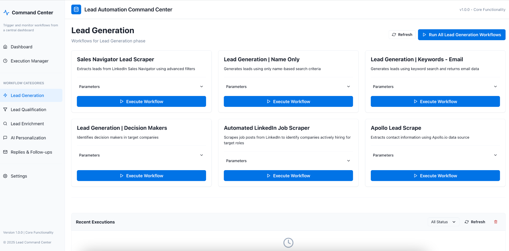
*The Lead Command Center dashboard provides a centralized view of all workflows and their status.*

### Core Capabilities

- **Automated Data Collection**: Extract targeted lead information from LinkedIn, Apollo.io, and other professional networks
- **AI-Powered Analysis**: Use artificial intelligence to qualify, enrich, and personalize prospect communications
- **Multi-Channel Communication**: Coordinate outreach across email, voice calls, and social media
- **Unified Data Management**: Centralize all prospect data with bi-directional CRM integration
- **Process Automation**: Eliminate manual tasks throughout the lead generation and outreach process

### Key Performance Metrics

The system achieves significant performance improvements across several key metrics:

- Lead generation time reduced by 50-70%
- Personalization time decreased from 3-5 minutes to under 10 seconds per lead
- Lead qualification accuracy increased to over 90% using AI-driven criteria
- Response rates improved by 25-40% through hyper-personalized messaging
- Cross-platform engagement unified across email, voice, and social channels
- Hard-to-reach prospect access increased from 10-15% to 35-45%

## System Architecture

The Lead Command Center is built on a modular architecture that enables flexibility, scalability, and reliable performance:

```
┌───────────────────────────────────────────────────────┐
│                  Web Command Center                   │
│  ┌─────────────┐  ┌────────────┐  ┌────────────────┐  │
│  │ Dashboard & │  │ Workflow   │  │ Analytics &    │  │
│  │ Monitoring  │  │ Control    │  │ Reporting      │  │
│  └─────────────┘  └────────────┘  └────────────────┘  │
└─────────────────────────┬─────────────────────────────┘
                          │
                          ▼
┌──────────────────────────────────────────────────────────────────┐
│                      Automation Engine (n8n)                     │
├──────────┬───────────┬──────────┬──────────────┬────────────────┬────────────────┤
│ Phase 1  │  Phase 2  │ Phase 3  │   Phase 4    │    Phase 5     │    Phase 6     │
│ Lead     │  Lead     │ Lead     │   AI         │    Replies &   │ Voice, Social, │
│ Generation│ Qualifier │ Enricher │Personalization│   Follow-ups   │    & CRM       │
└──────────┴─────┬─────┴────┬─────┴───────┬──────┴────────────────┴────────────────┘
                 │          │             │
    ┌────────────┘          │             └──────────────┐
    │                       │                            │
    ▼                       ▼                            ▼
┌─────────────┐     ┌──────────────┐             ┌─────────────────┐
│ External    │     │ Data Storage │             │ Communication    │
│ Data Sources│     │ & Processing │             │ Channels         │
├─────────────┤     ├──────────────┤             ├─────────────────┤
│ LinkedIn    │     │ Airtable     │             │ Email Systems   │
│ Apollo.io   │     │ Google Sheets│             │ Voice Agents    │
│ Websites    │     │ GPT-4o API   │             │ Social Media    │
│ Social Media│     │ HubSpot CRM  │             │ Slack Alerts    │
└─────────────┘     └──────────────┘             └─────────────────┘
```

### Architecture Components

#### 1. Web Command Center
The central control interface provides visibility and management capabilities:

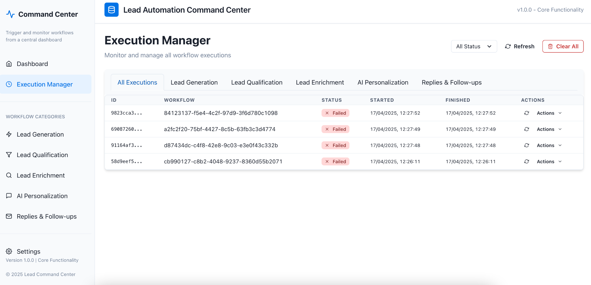
*The execution center allows monitoring of workflow status and performance.*

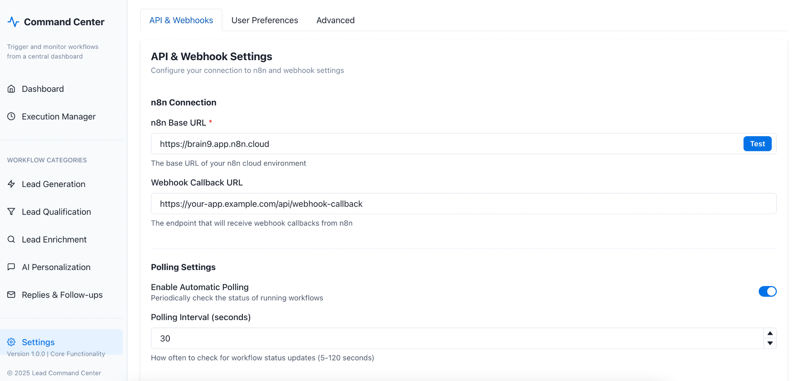
*System settings and configuration options for the Command Center.*

#### 2. Automation Engine (n8n)
The core automation platform orchestrates all workflows:

- **Workflow Scheduler**: Manages timing and sequence of tasks
- **Error Handling**: Ensures reliable execution with automatic retries
- **Data Transformation**: Standardizes information between systems
- **Webhook Integration**: Connects to external triggers and systems
- **Cross-phase Coordination**: Enables seamless data flow between phases

#### 3. External Data Sources
Connects to various systems to gather prospect information:

- **API Integrations**: LinkedIn, Apollo.io, and other professional networks
- **Web Scraping**: Company websites and public information sources
- **Social Media APIs**: Direct connections to social platforms
- **VAPI Voice System**: AI-powered voice conversation capabilities

#### 4. Data Storage & Processing
Manages and enriches prospect information:

- **Database Systems**: Airtable, Google Sheets, MongoDB
- **AI Processing**: GPT-4o, Claude, and Azure AI models
- **CRM Integration**: HubSpot with bi-directional synchronization
- **Data Enrichment**: Combines information from multiple sources
- **Multi-tenant Isolation**: Secure separation of client data

#### 5. Communication Channels
Handles interactions with prospects:

- **Email Systems**: Instantly, Mailgun, SendGrid
- **Voice Communication**: VAPI for AI voice conversations
- **Social Platforms**: Direct messaging and monitoring
- **Team Alerts**: Slack and email notifications
- **Cross-channel Coordination**: Unified messaging across platforms

## System Phases & Workflows

The Lead Command Center is organized into six distinct phases, each handling a specific part of the lead generation and engagement process:

### Phase 1: Lead Generation
This phase focuses on extracting targeted leads from various sources.

#### Key Workflows:

**Sales Navigator Lead Scraper**  
Extracts leads from LinkedIn Sales Navigator using advanced filters.

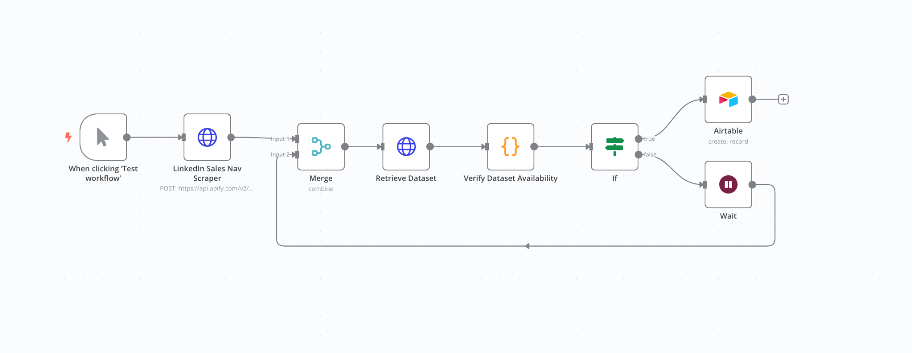
*Workflow for extracting leads from LinkedIn Sales Navigator.*

**Lead Generation | Name Only**  
Generates leads using only company name-based search.

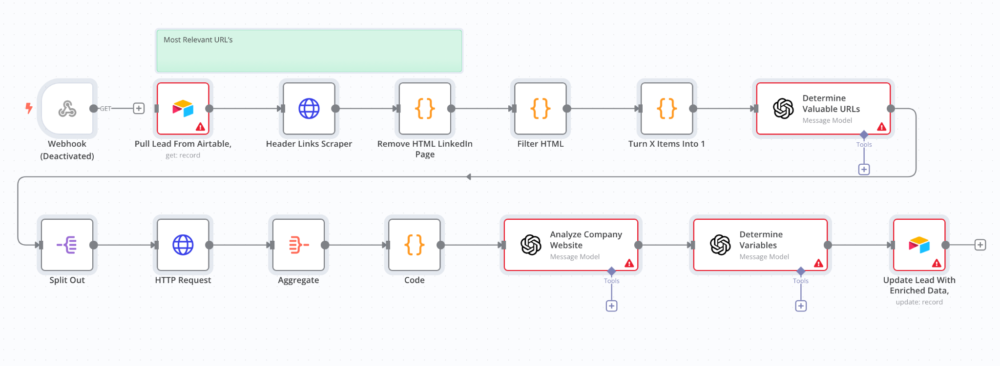
*Workflow for generating leads using company name search.*

**Lead Generation | Keywords - Email**  
Finds leads based on keyword search with email verification.
1. Accepts keywords and location parameters
2. Searches Apollo.io for matching companies
3. Filters and removes duplicates
4. Scrapes company LinkedIn profiles for additional info
5. Identifies decision-makers based on company size
6. Verifies email addresses for deliverability
7. Updates CRM with qualified leads

**Lead Generation | Decision Makers**  
Identifies key decision-makers in target companies.

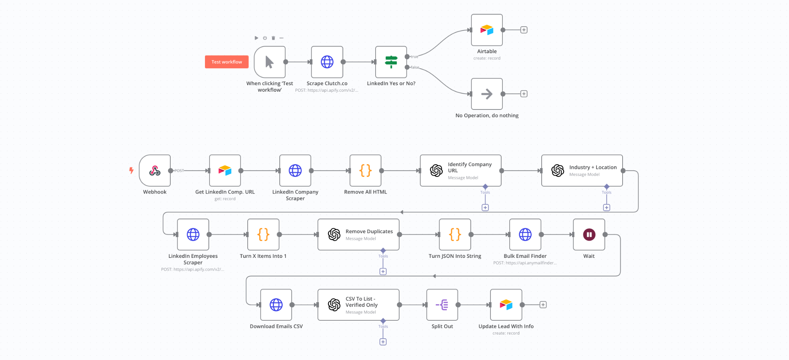
*Workflow for identifying decision makers in target companies.*

**Automated LinkedIn Job Scraper**  
Finds companies hiring for specific roles as sales indicators.

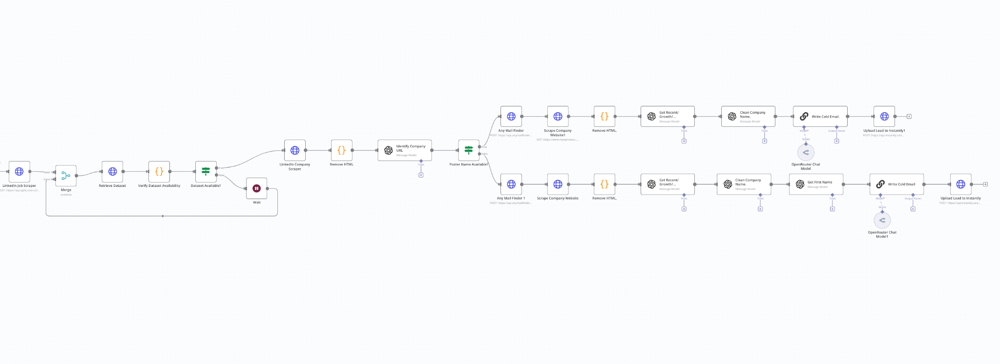
*Workflow for scraping LinkedIn job posts to identify companies with hiring signals.*

**Apollo Lead Scrape**  
Pulls contact information from Apollo.io database.

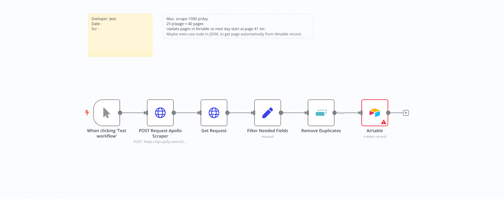
*Workflow for extracting lead information from Apollo.io.*

### Phase 2: Lead Qualification
This phase filters leads based on intent and relevance criteria.

#### Key Workflows:

**3-Step Lead Qualification**  
Filters leads based on job title, company criteria, and signals.

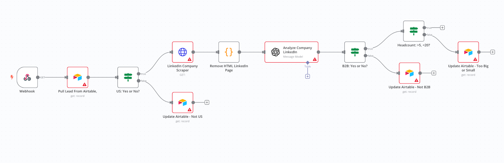
*Workflow for qualifying leads through a 3-step filtering process.*

**Personalization**  
Flags qualified leads for enrichment and outreach.

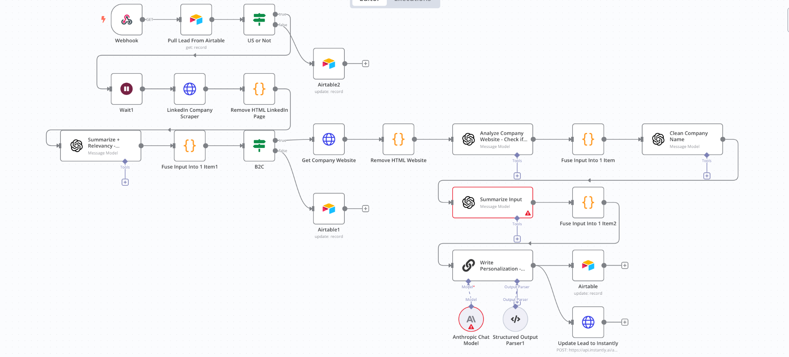
*Workflow for flagging and preparing qualified leads for personalization.*

### Phase 3: Lead Enrichment
This phase adds depth to lead profiles with additional data sources.

#### Key Workflows:

**LinkedIn**  
Extracts professional insights from LinkedIn profiles.

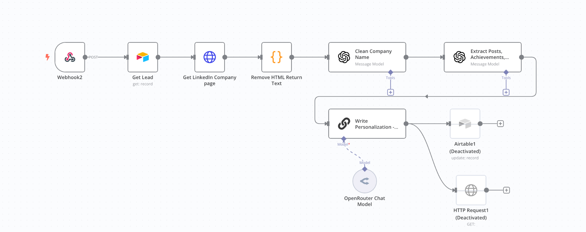
*Workflow for enriching leads with LinkedIn profile data.*

**Scrape + Enrich**  
Combines multiple data sources for comprehensive profiles.

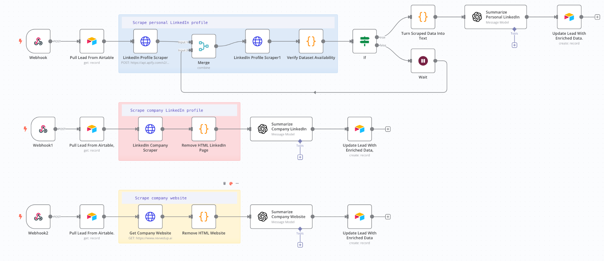
*Workflow for combining multiple data sources for comprehensive enrichment.*

**Enrichment | Website Sections**  
Intelligently extracts specific sections from company websites.

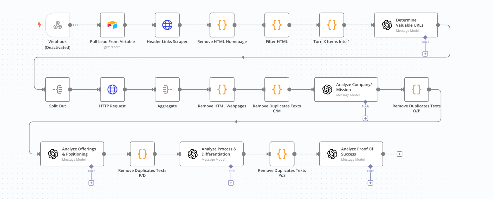
*Workflow for extracting specific valuable sections from company websites.*

**Company Website | Smart Crawler**  
Intelligently navigates and extracts website information.

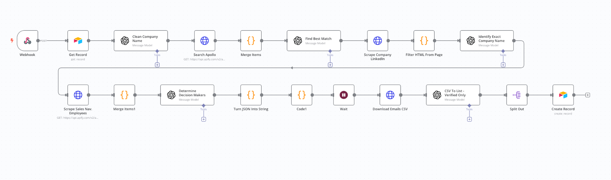
*Workflow for intelligently crawling company websites for valuable information.*

### Phase 4: AI Personalization
This phase uses AI to create highly personalized outreach content.

#### Key Workflows:

**Deep Insights - About Page**  
Extracts company values and mission for personalization.

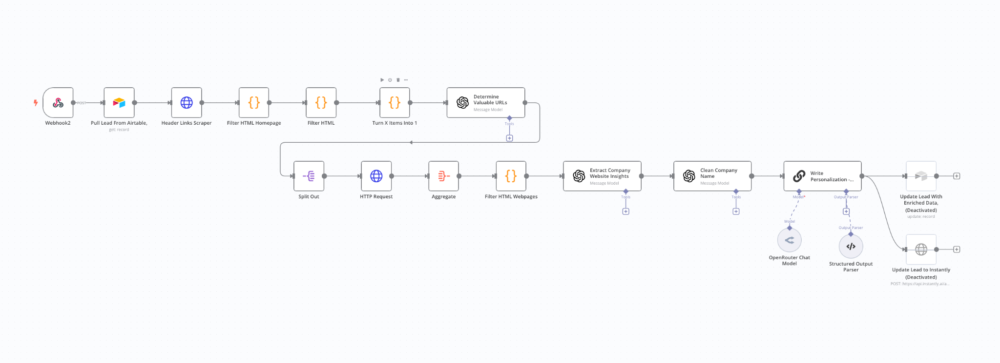
*Workflow for extracting company values and mission from about pages.*

**LinkedIn Post | Personal + Company**  
Analyzes LinkedIn activity for personalization angles.

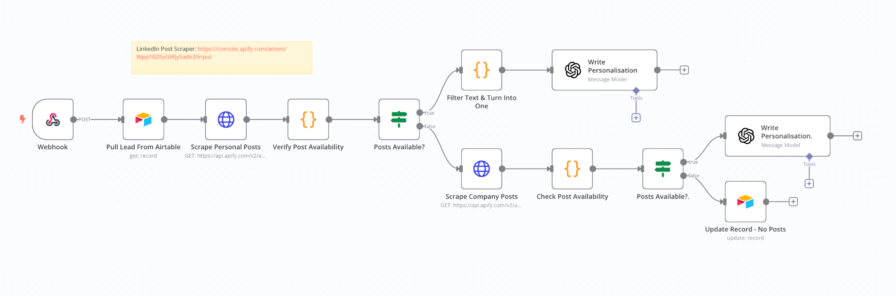
*Workflow for analyzing LinkedIn activity for personalization angles.*

**AI Personalization | 3 Snippets**  
Creates three distinct personalization approaches.

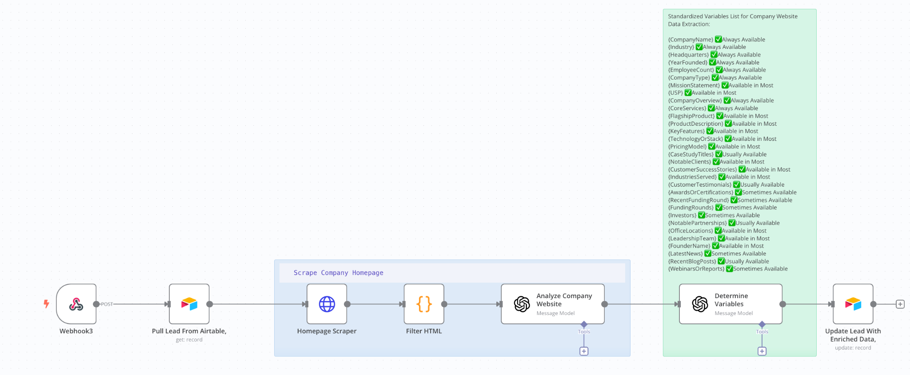
*Workflow for generating three distinct personalization snippets.*

**AI Personalization | Departments**  
Tailors messaging to prospect's department and role.

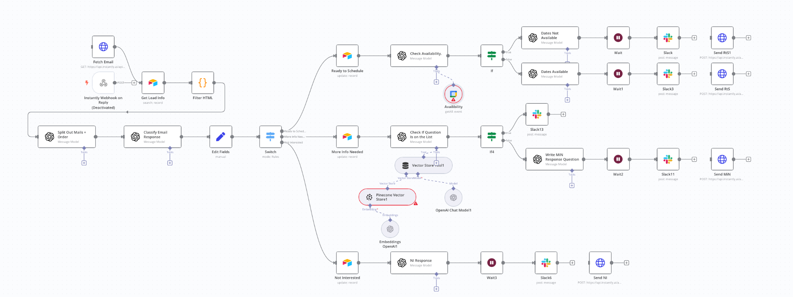
*Workflow for tailoring messages based on prospect's department and role.*

### Phase 5: Replies & Follow-ups
This phase manages ongoing email communication.

#### Key Workflows:

**AI Personalization | Departments**  
Handles email replies and follow-up sequences.

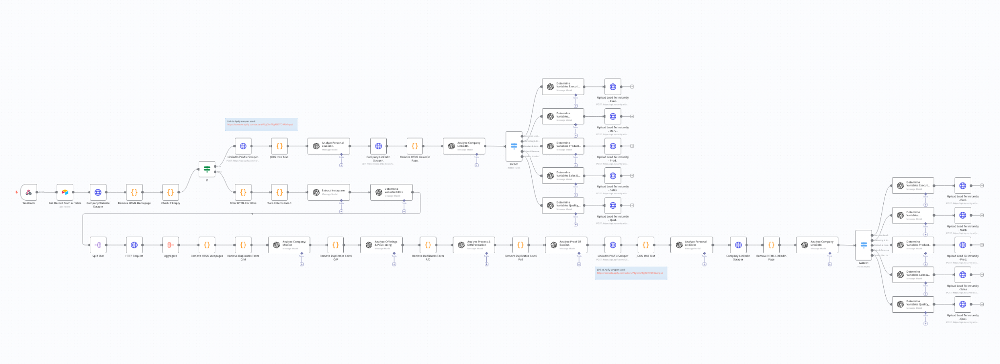
*Workflow for handling email replies and follow-up sequences.*

### Phase 6: Voice Follow-ups, Social Media & CRM Integration
This phase extends engagement to additional channels and systems.

#### Key Workflows:

**Voice Agent Automated Calling**  
Uses AI voice agents for phone follow-up.

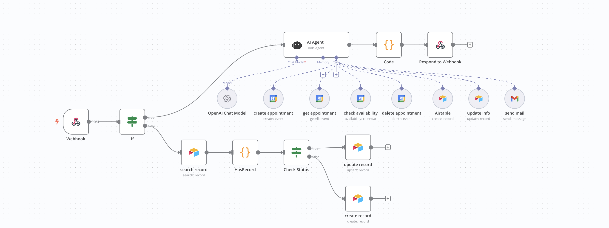
*Workflow for AI voice agent automated calling.*

**Social Media Support Agents**  
Monitors and engages across social platforms.

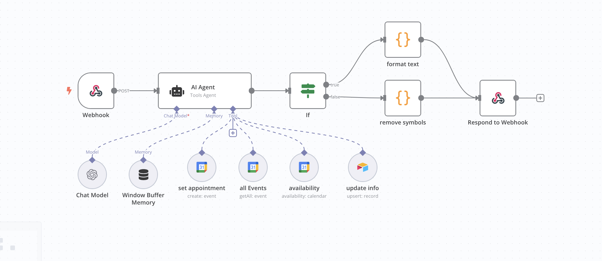
*Workflow for monitoring and engaging on social media platforms.*

**HubSpot CRM Integration**  
Provides seamless HubSpot connectivity with tenant creation.
1. Sets up secure API authentication
2. Maps data fields between systems
3. Synchronizes data bi-directionally
4. Creates workflow triggers in HubSpot
5. Configures custom deal pipelines
6. Enriches contact records with automation data
7. Integrates email sequences between systems
8. Sets up meeting booking integration
9. Creates custom reporting dashboards
10. Configures multi-tenant isolation
11. Automates tenant creation for new clients

## Technologies and Integrations

The Lead Command Center leverages a wide range of technologies:

### Core Automation
- **n8n**: Primary workflow automation platform

### Data Collection
- **Apify**: Enterprise-grade web scraping platform
- **Bright Data**: Proxy rotation and management
- **ScrapingBee**: Additional scraping capabilities

### Lead Sources
- **LinkedIn Sales Navigator**: Professional targeting and search
- **Apollo.io**: B2B contact database
- **Clutch.co**: Verified company directory
- **ZoomInfo**: Additional contact verification

### Artificial Intelligence
- **OpenAI GPT-4o**: Primary content generation and analysis
- **Claude 3 Opus**: Additional language processing
- **Azure AI**: Supplementary AI services

### Voice & Communication
- **VAPI**: AI voice conversation system
- **Instantly API**: Email delivery and tracking
- **Mailgun/SendGrid**: Additional email services

### Email Verification
- **AnyMailFinder**: Email discovery service
- **Hunter.io**: Email verification
- **Clearout**: Deliverability checking

### CRM & Data Storage
- **HubSpot API**: Enterprise CRM integration
- **Airtable**: Flexible database system
- **Google Sheets**: Supplementary data storage
- **MongoDB**: Advanced data management

### Notifications & Scheduling
- **Slack**: Team alerts and notifications
- **Microsoft Teams**: Enterprise communication
- **Calendly**: Appointment scheduling
- **Google/Outlook Calendar**: Calendar integration

### Analytics & Security
- **Google Analytics**: Performance tracking
- **Custom Dashboards**: Visualization tools
- **JWT Authentication**: Secure authorization
- **OAuth 2.0**: API security
- **API Key Management**: Access control

## Technical Implementation Best Practices

When implementing or adapting a system like the Lead Command Center, consider these best practices:

### Error Handling & Resilience
- Implement comprehensive error catching for external API calls
- Create fallback mechanisms when primary data sources are unavailable
- Use wait nodes to prevent rate limiting issues
- Set up monitoring alerts for workflow failures

### Data Processing Optimization
- Filter HTML before sending to AI to reduce token usage
- Remove duplicate content to optimize processing costs
- Split complex workflows into smaller, focused nodes
- Use JSON formatting for structured AI outputs

### Security Considerations
- Implement proper API key rotation and secure storage
- Use tenant isolation for multi-client implementations
- Set up appropriate access controls for sensitive data
- Ensure compliance with data protection regulations

### Performance Tuning
- Batch process leads when possible to reduce API calls
- Schedule resource-intensive workflows during off-hours
- Monitor execution times and optimize bottlenecks
- Use caching for frequently accessed data

### Scalability Planning
- Design workflows to handle volume increases
- Implement database indexing for larger datasets
- Consider distributed processing for high-volume scenarios
- Test workflows with increasing data volumes

## Conclusion

The Lead Command Center represents a sophisticated approach to modern lead generation and engagement, combining multiple technologies into a cohesive system. By understanding its architecture, workflows, and technical foundations, organizations can implement similar systems or adapt components to enhance their sales and marketing operations.

The power of this approach lies in its end-to-end automation, from initial lead discovery through multi-channel engagement and CRM integration. By leveraging AI for personalization and decision-making, the system delivers capabilities that were previously impossible at scale.

Whether you're building your own automation system or evaluating existing solutions, the principles and architecture outlined in this document provide valuable insights into the future of sales technology and automation.
